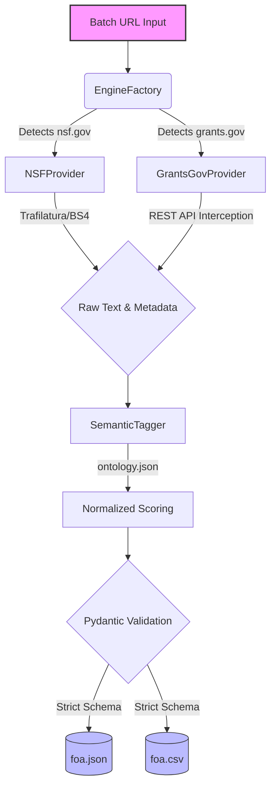

# GSoC 2026: AI-Powered Funding Intelligence (ISSR4)

**Test Targets (Multi-Source Batch):** 
1. [NSF 26-506 (PESOSE)](https://www.nsf.gov/funding/opportunities/pesose-pathways-enable-secure-open-source-ecosystems/nsf26-506/solicitation)
2. [Grants.gov (RFA-AG-25-017)](https://www.grants.gov/search-results-detail/352941)

## The Problem
Research teams waste hours manually parsing government funding portals. FOAs are scattered all over the place, vary wildly in structure (HTML vs SPA), and are hard to track. We lose critical time to manual scraping that should go to actual research and proposal writing.

## The Solution: A Modular Multi-Source Engine
This repository contains the screening task for the FOA Ingestion and Semantic Tagging pipeline. Instead of a brittle, single-site web scraper, this implements an **Advanced Object-Oriented Provider Architecture**. It automatically detects the source URL, routes to the correct extraction strategy (DOM parsing vs API interception), and normalizes the data into a strict `Pydantic` schema.

### Current Platform Support

| Platform | Frontend Type | Ingestion Strategy | Data Quality |
|----------|---------------|---------------------|--------------|
| **NSF** | Static HTML | Hybrid DOM Parsing (`Trafilatura` + `BeautifulSoup`) | High (Full text & strict metadata) |
| **Grants.gov** | Dynamic SPA (Angular/React) | **Hidden API Interception** (Bypasses DOM entirely) | High (Direct JSON payload extraction) |

## System Architecture



## Engineering Philosophy
1. **Strict Data (Pydantic):** Government sites are messy. By pushing data through a strict Pydantic model we ensure databases don't break on bad dates or weird currency text.
2. **Smart Bypassing:** Instead of fighting Grants.gov's heavy JavaScript frontend with brittle Selenium scripts, the `GrantsGovProvider` intercepts the backend REST API directly.
3. **Weighted Tagging:** Just matching keywords is not enough. The `SemanticTagger` loads an external `ontology.json` to calculate normalized confidence scores where the sum of all tags equals 1.0.
4. **Rich Terminal UI:** Built with `argparse` and `rich`, the pipeline gives a colorful, clear terminal UI to summarize batch extractions.

---

## 🚀 The Main Stage: GSoC Full Project Roadmap
While this screening task proves the core pipeline and multi-source capability, the full summer project will expand this foundation into a production-ready intelligence system:

| Phase | Planned Implementation for Main Stage |
|-------|---------------------------------------|
| **Expanded Ingestion** | Add providers for NIH, DOE, and DOD. Implement Playwright headless browser fallback for aggressive SPAs without public APIs. |
| **Advanced Semantic Tagging** | Upgrade from deterministic ontology to **LLM-assisted classification** and sentence-transformer embeddings (Hugging Face) for deep semantic matching. |
| **Vector Indexing** | Integrate FAISS or ChromaDB to allow researchers to run similarity searches against historical grants. |
| **Automated Workflows** | Deploy the pipeline as a daily cron job that pushes new opportunities to a lightweight web UI or Slack/Teams alerts. |

---

## Execution Instructions

### 1. Install Dependencies
```bash
pip install -r requirements.txt
```

### 2. Run the Batch Engine
Process multiple platforms simultaneously by passing a comma-separated list of URLs:
```bash
python main.py --urls "https://www.nsf.gov/funding/opportunities/pesose-pathways-enable-secure-open-source-ecosystems/nsf26-506/solicitation,https://www.grants.gov/search-results-detail/352941" --out_dir ./out
```

### 3. The Output
The pipeline generates `foa.json` (as an array of records) and `foa.csv` in the output directory.

**Sample Terminal Output:**
```text
Batch Extraction Summary                           
┏━━━━━━━━━━━━━━━┳━━━━━━━━━━━━━━━━━━━━━━━━━━━━━━━━━━━┳━━━━━━━━━━━━━━━━━━━━━━━━┓
┃ FOA ID        ┃ Agency                            ┃ Award Range            ┃
┡━━━━━━━━━━━━━━━╇━━━━━━━━━━━━━━━━━━━━━━━━━━━━━━━━━━━╇━━━━━━━━━━━━━━━━━━━━━━━━┩
│ NSF26-506     │ National Science Foundation (NSF) │ $300,000 - $40,000,000 │
│ RFA-AG-25-017 │ National Institutes of Health     │ Up to $500,000         │
└───────────────┴───────────────────────────────────┴────────────────────────┘
```
