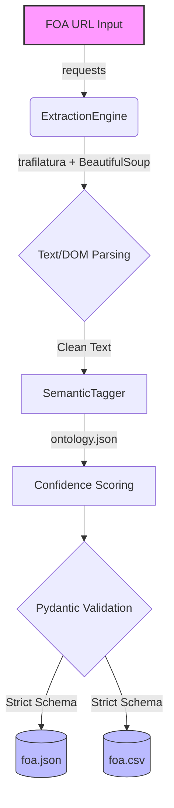

# GSoC 2026: AI-Powered Funding Intelligence (ISSR4)

## The Problem
Research development teams spend hundreds of hours manually parsing government funding portals. Funding Opportunity Announcements (FOAs) are scattered, densely formatted, and notoriously hard to track. We are losing critical time to manual PDF scraping—time that should be spent on actual research and proposal development.

## The Solution
This repository contains the screening task for the **FOA Ingestion + Semantic Tagging** pipeline. It's not just a script; it's the foundation for a production-grade intelligence engine. It automates the ingestion of FOAs from Grants.gov and the NSF, sanitizes the raw HTML/PDFs into strict schemas, and applies a weighted semantic tagging system so grants can be queried and matched mathematically.

## System Architecture



## Engineering Philosophy
Building for institutional research requires more than just extracting text—it requires absolute reliability. Here is how this pipeline approaches the problem:

1. **Strict Data Contracts (`Pydantic`):** Government endpoints are unpredictable. By forcing all extracted data through a strict Pydantic `FOARecord` model, we guarantee that downstream databases never choke on malformed dates or broken currency strings.
2. **High-Fidelity Signal (`Trafilatura`):** Standard web scraping pulls in navigation bars, footers, and HTML noise that destroys semantic tagging accuracy. This engine uses `trafilatura` to strip the boilerplate and isolate the true programmatic text of the grant.
3. **Weighted Semantic Tagging:** Binary keyword matching isn't enough. The `SemanticTagger` loads an external `ontology.json` to calculate normalized confidence scores based on term frequency and ontology weights, allowing future grant-matching algorithms to rank relevance properly.
4. **Beautiful CLI Orchestration:** Tools should be a joy to use. Built with `argparse` and `rich`, the pipeline provides a clean, colorful terminal UI summarizing the extraction success.

## Execution Instructions

### 1. Install Dependencies
```bash
pip install -r requirements.txt
```

### 2. Run the Engine
```bash
python main.py --url "https://www.nsf.gov/pubs/2023/nsf23561/nsf23561.htm" --out_dir ./out
```

### 3. The Output
The pipeline reliably generates `foa.json` and `foa.csv` in the designated output directory.

**JSON Structure:**
```json
{
  "metadata": {
    "generated_at": "2026-03-27T10:00:00Z",
    "schema_version": "1.1.0",
    "extractor_engine": "ISSR4-Primary"
  },
  "data": {
    "foa_id": "NSF23-561",
    "title": "...",
    "award_ceiling": 500000,
    "tags": ["artificial_intelligence", "computer_systems"],
    "tag_scores": {"artificial_intelligence": 0.6, "computer_systems": 0.24}
  }
}
```
