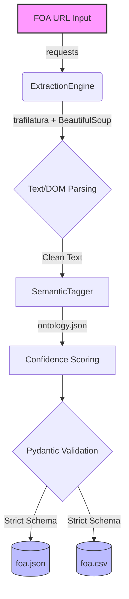

# GSoC 2026: AI-Powered Funding Intelligence (ISSR4)

**Test Target:** [NSF 26-506: Pathways to Enable Secure Open-Source Ecosystems (PESOSE)](https://www.nsf.gov/funding/opportunities/pesose-pathways-enable-secure-open-source-ecosystems/nsf26-506/solicitation)


## The Problem
Research teams waste hours manually parsing government funding portals. FOAs are scattered all over the place and hard to track. We lose critical time to manual scraping. That time should go to actual research and proposal writing.

## The Solution
This repo has the screening task for the FOA Ingestion and Semantic Tagging pipeline. This is not just a basic script but a solid foundation for a real intelligence engine. It automates FOA ingestion from Grants.gov and NSF. It cleans the raw HTML into strict schemas and applies a weighted semantic tagging system so grants can be matched easily.

## System Architecture



## Engineering Philosophy
Building for research needs more than just pulling text. It needs reliability. Here is how this pipeline works:

1. **Strict Data (Pydantic):** Government sites are messy. By pushing data through a strict Pydantic model we make sure databases don't break on bad dates or weird currency text.
2. **Clean Signal (Trafilatura):** Normal web scraping pulls in navbars and HTML junk that ruins tagging. This uses trafilatura to strip the noise and keep only the real grant text.
3. **Multi-Source Handling (Optimized for NSF):** The current ingestion module is optimized for static government portals (like NSF) where content is available in the initial DOM.
4. **The SPA Roadmap (Grants.gov):** Many portals like Grants.gov are built as Single Page Apps (SPA) that require JavaScript execution. For the full GSoC project I will integrate a headless browser like Playwright to handle these dynamic environments.
5. **Weighted Tagging:** Just matching keywords is not enough. The SemanticTagger uses an external ontology.json to calculate confidence scores based on term frequency. This helps future algorithms rank relevance better.
6. **Clean CLI:** Tools should be nice to use. Built with argparse and rich the pipeline gives a nice colorful terminal UI to summarize the extraction.

## Execution Instructions

### 1. Install Dependencies
```bash
pip install -r requirements.txt
```

### 2. Run the Engine
```bash
python main.py --url "https://www.nsf.gov/funding/opportunities/pesose-pathways-enable-secure-open-source-ecosystems/nsf26-506/solicitation" --out_dir ./out
```

### 3. The Output
The pipeline generates foa.json and foa.csv in the output directory.

**JSON Structure:**
```json
{
  "metadata": {
    "generated_at": "2026-03-27T10:00:00Z",
    "schema_version": "1.2.0",
    "extractor_engine": "ISSR4-MultiSource"
  },
  "data": {
    "foa_id": "NSF26-506",
    "title": "...",
    "award_ceiling": 40000000,
    "tags": ["artificial_intelligence", "computer_systems"],
    "tag_scores": {"artificial_intelligence": 0.6, "computer_systems": 0.8}
  }
}
```
