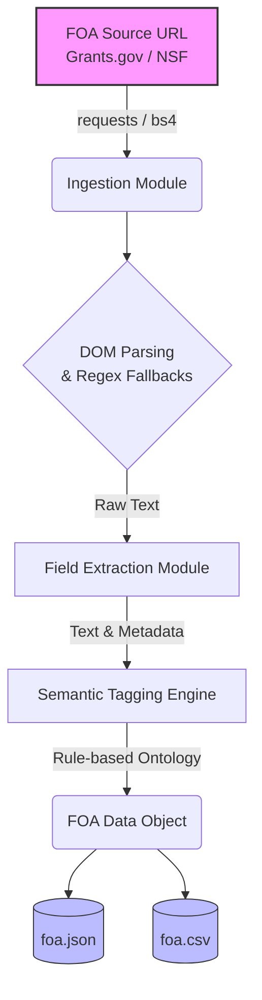

# GSoC 2026: AI-Powered Funding Intelligence (ISSR4)
**Applicant:** Samuel Kalu  
**Role:** Senior ML Engineer (7+ Years Experience)

## Overview
This repository contains the screening task for the **FOA Ingestion + Semantic Tagging** project. The objective is to automate the ingestion of Funding Opportunity Announcements (FOAs), normalize them into a structured schema, and apply deterministic semantic tags.

## System Architecture



## Design Philosophy & Trade-offs
As an ML Engineer, my core focus is transitioning messy research prototypes into reliable, production-ready systems. 
* **Robust Ingestion:** Government HTML is notoriously inconsistent. I built the ingestion module (`main.py`) to parse DOM structures where available, but utilize regex fallbacks for robust metadata extraction (like ISO dates and FOA IDs) when standard CSS classes fail. This prevents pipeline crashes.
* **Deterministic Tagging vs. Embeddings:** For this MVP, I implemented a fast, rule-based ontology dictionary mapping keywords to tags (e.g., `AI/ML`, `Computer Science`). However, the architecture is deliberately modular. Swapping this out for a `sentence-transformers` based semantic similarity matcher (Chroma/FAISS) for the final project will require replacing only a single isolated function block.

## Execution Instructions

### 1. Install Dependencies
```bash
pip install -r requirements.txt
```

### 2. Run the Ingestion Pipeline
```bash
python main.py --url "https://www.nsf.gov/pubs/2023/nsf23561/nsf23561.htm" --out_dir ./out
```

### 3. Output Validations
The pipeline successfully generates the requested normalized formats:
- `out/foa.json`
- `out/foa.csv`
