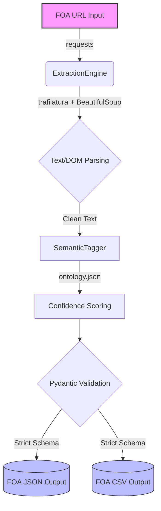

# GSoC 2026: AI-Powered Funding Intelligence (ISSR4)
**Applicant:** Samuel Kalu  
**Role:** Senior ML Engineer

## Overview
This repository contains a production-grade screening task for the **FOA Ingestion + Semantic Tagging** project. The pipeline automates the ingestion of Funding Opportunity Announcements (FOAs) from Grants.gov and NSF, validates them via strict `Pydantic` schemas, and applies a weighted, ontology-based semantic tagging engine.

## System Architecture



## Engineering Upgrades vs. Baseline Requirements
To ensure this pipeline is truly production-ready for an institutional research team, I implemented several advanced features beyond the basic requirements:

1. **Strict Schema Validation (`Pydantic`):** Instead of passing loose dictionaries, all extracted data flows through a strict Pydantic `FOARecord` model. This ensures fields like dates are properly ISO-formatted and currency amounts are typed as integers.
2. **Weighted Semantic Tagging:** The `SemanticTagger` doesn't just do binary keyword matching. It utilizes an external `ontology.json` to calculate normalized confidence scores (`tag_scores: Dict[str, float]`) based on term frequency and ontology weights, allowing downstream grant matching systems to rank relevance.
3. **High-Fidelity Text Extraction (`trafilatura`):** Government HTML is notoriously bloated. Instead of raw regex or basic `bs4.get_text()`, the engine uses `trafilatura` to strip boilerplate navbars and footers, extracting only the core programmatic text for highly accurate semantic tagging.
4. **Rich CLI Orchestration:** Includes `argparse` orchestration with a beautifully formatted terminal UI (`rich`) for extraction summaries.

## Execution Instructions

### 1. Install Dependencies
```bash
pip install -r requirements.txt
```

### 2. Run the Ingestion Pipeline
```bash
python main.py --url "https://www.nsf.gov/pubs/2023/nsf23561/nsf23561.htm"
```

### Output Schema
The pipeline generates `foa_{ID}.json` and `foa_{ID}.csv` in the `./out` directory.

**JSON Structure:**
```json
{
  "metadata": {
    "generated_at": "2026-03-27T10:00:00Z",
    "schema_version": "1.1.0",
    "extractor_engine": "ISSR4-Primary"
  },
  "data": {
    "foa_id": "NSF23-561",
    "title": "...",
    "award_ceiling": 500000,
    "tags": ["artificial_intelligence", "computer_systems"],
    "tag_scores": {"artificial_intelligence": 0.6, "computer_systems": 0.24}
  }
}
```
